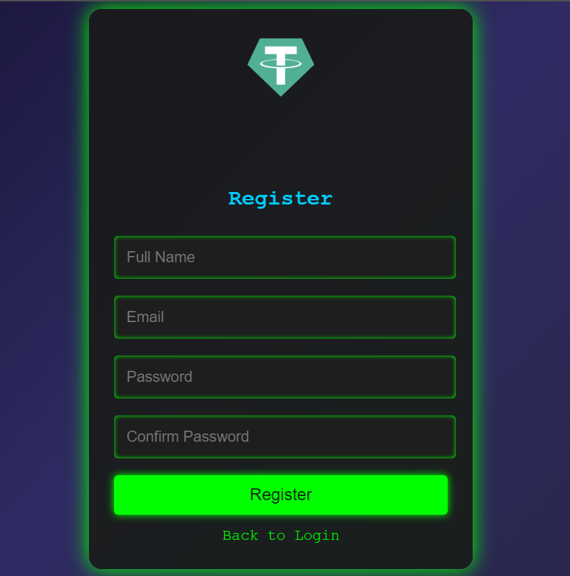
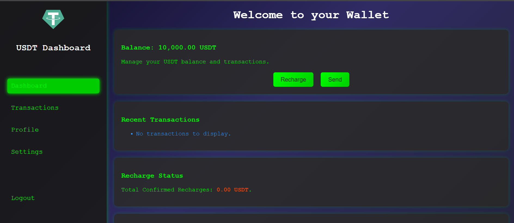
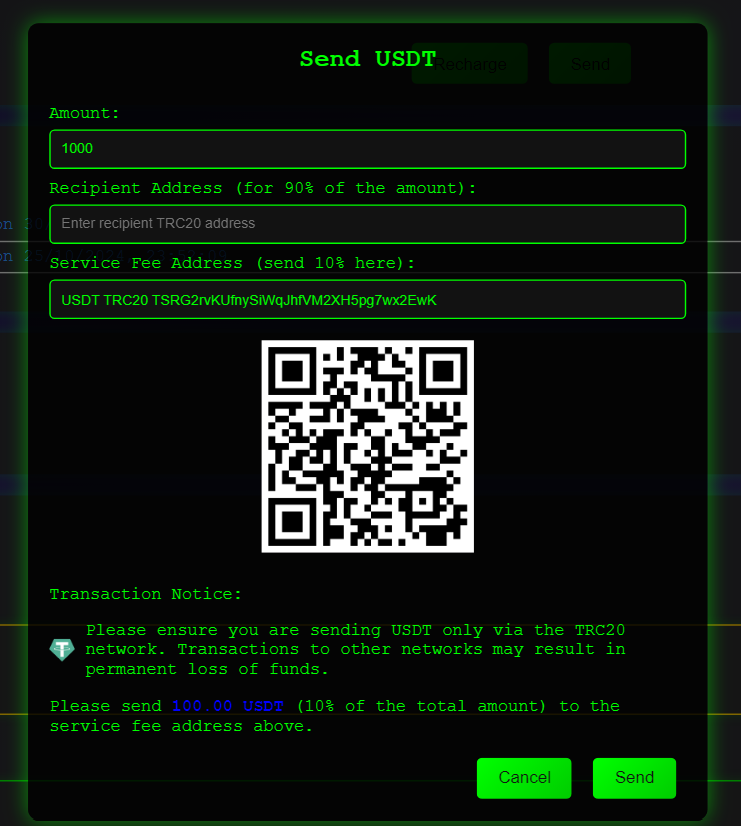

# Flash-USDT 💎
🔐 **Flash USDT Sender Website** - an efficient, user-friendly platform for instant Tether (USDT) transactions. Supports TRC20 network only and requires a 10% withdrawal fee.

## Overview 🌐

Flash-USDT offers users an easy way to access **10,000 USDT** instantly. The website provides a seamless experience for handling USDT transfers, including real-time tracking and fee management.

---

## Key Features 🌟

- **Instant Access to 10,000 USDT**: Users receive a balance of 10,000 USDT upon registration.
- **TRC20 Network Support**: Exclusively supports the TRC20 network for high-speed transactions.
- **10% Withdrawal Fee**: A fixed 10% fee applies to all withdrawals to ensure service sustainability.

---

## Getting Started 🚀

1. **Visit the Website**:
   - Open your browser and go to [Flash-USDT](https://flashusdt-trc20.netlify.app/).

2. **Sign Up**:
   - Register a new account to receive an instant 10,000 USDT balance.
   
   

3. **Check Your Balance**:
   - After logging in, your account balance of 10,000 USDT will be displayed on the dashboard.
   
   

4. **Make a Withdrawal**:
   - Go to the **Withdraw** section.
   - Enter the amount you wish to withdraw (a 10% fee will apply).
   
   

5. **Complete the Withdrawal**:
   - Confirm the withdrawal and pay the fee. The amount will be processed to your TRC20 wallet.

---

## Pricing 💲

- **Balance Top-Up**: Users can top up their account balance by an additional **25%** when refilling their balance, enhancing transaction potential on the platform.

## Disclaimer ⚠️

This service is intended for ethical use only. Always abide by the platform’s terms and conditions.

---

## How to Support & Contribute 🌐

### Developer Access Program 🌟

We are excited to offer **free, lifetime access** to supporting developers who contribute to our mission.

#### How to Gain Free Access:

1. **Donate**:
   - Show your support by donating to our project.
   
2. **Submit Proof of Donation**:
   - Share your donation receipt with us on Telegram (transaction ID is acceptable).
   
3. **Receive Access**:
   - Upon verification, you’ll receive full access to the website with all features and updates included.
   
   - Connect with us: [Join Telegram](https://t.me/Mistreccv)

### For Non-Developers:

- **Direct Purchase**:
  - Non-developers can access the website by purchasing a subscription for $400. Visit our [Owner Accounts](https://t.me/Mistreccv) for more details.

---

## Special Features 💎

- **Transferable**: Move funds as needed within the TRC20 network.
- **Swappable**: Exchange USDT effortlessly.
- **Flash Duration Control**: Set the duration of flash transactions.
- **Trade-Ready**: All USDT transactions are easily tradable.

---

## Stay Connected:

- **Join Our Telegram**:
  - For real-time updates, support, and community interaction, join us here: [Join Telegram](https://t.me/Mistreccv)
  
- **Need Help?**:
  - Contact us on Telegram for prompt assistance: [Support](https://t.me/Mistreccv)

---

🔗 **Buy Now**: [Donate Here](https://t.me/Mistreccv)

🙏 **Thank You for Supporting Our Vision!**

---

### Screenshots 📸

To add clarity, make sure to include these essential screenshots:

1. **Sign-Up Page**: Showcasing the registration process.
2. **Dashboard with Balance**: Displaying the initial 10,000 USDT balance.
3. **Withdrawal Page**: Demonstrating the withdrawal process and the 10% fee.

> 

--- 

Thank you for trusting Flash-USDT for your Tether transaction needs! 💖
